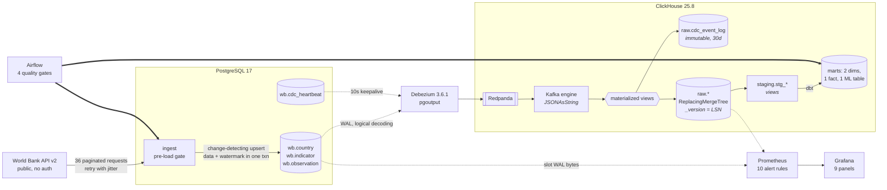

# wb-cdc-analytics

[](https://github.com/matidesalegn/wb-cdc-analytics/actions/workflows/ci.yml)

An end-to-end analytics engineering pipeline. A public REST API is ingested into
PostgreSQL, change events are streamed out of the write-ahead log by Debezium into
ClickHouse in near real time, and dbt shapes a staging layer, an analytics mart and a
machine-learning feature table on top. Orchestrated by Airflow, monitored by Prometheus
and Grafana, tested in CI, and started with one command.

```bash
make demo
```

That is the whole thing. It runs preflight checks, generates secrets, starts the stack,
applies all DDL, registers the CDC connector, ingests from the API, waits for the change
events to land, builds and tests the dbt models, and prints a row count for every stage.
It is idempotent: run it twice and the second run exercises the change-detection and
incremental paths rather than repeating the first.

**Design report:** [`docs/design-report.md`](docs/design-report.md)
**Measured source-API behaviour:** [`docs/source-api-notes.md`](docs/source-api-notes.md)
**Measured CDC wire format:** [`docs/cdc-wire-format.md`](docs/cdc-wire-format.md)
**Scope contract and deliberate omissions:** [`docs/SCOPE.md`](docs/SCOPE.md)

---

## Running the pipeline end to end

```bash
git clone https://github.com/matidesalegn/wb-cdc-analytics.git
cd wb-cdc-analytics
make demo
```

| | |
|---|---|
| Prerequisites | Docker with Compose v2, Python 3 on the host, roughly 4 GB free to Docker |
| First run | 3 to 6 minutes if images are cached, 10 to 15 on a cold pull (about 8 GB) |
| Ingestion from the live API | 8 to 10 minutes for 2,970 rows across 36 paginated requests. That is upstream latency, not pipeline latency |
| Offline, in about 1 second | `SOURCE_API_MODE=fixture make demo` replays committed responses with no network at all |
| What "done" looks like | `verify_stages.sh` prints PASS for all six stages and exits 0 |

`make demo` refuses to continue rather than guessing: `make preflight` checks Docker's
memory allocation, free disk and port availability first, and every step waits for the
thing it depends on instead of sleeping.

### Everything else

```bash
make help        # every target, self-documenting
make up          # core path only: Postgres, Redpanda, Connect, ClickHouse (4 containers)
make up-mon      # core + Prometheus + Grafana
make up-all      # everything, including Airflow
make verify      # prove data moved through every stage
make demo-mutations   # prove an UPDATE propagates and a DELETE disappears
make urls        # print every endpoint and its credentials
make down        # stop, keeping data (drops the replication slot first)
make clean       # stop and delete this project's volumes
```

## Dependencies and setup

**Required:** Docker Engine with Compose v2 (`docker compose`, not the legacy
`docker-compose`), Python 3.9+ on the host for the setup and verification scripts, and
`curl`. Nothing else: every runtime dependency lives in a pinned container image.

**Secrets.** The repository ships none. `make env` generates `.env` from
`.env.example`, replacing each `CHANGEME_GENERATED` placeholder with a fresh random
secret, and `.env` has been in `.gitignore` since the first commit. `make demo` calls it
for you. Re-running it will not overwrite an existing `.env`, because rotating the
passwords under live volumes would leave the databases rejecting them.

**Resources.** Every image tag is pinned and memory is capped explicitly, so the
footprint is predictable rather than dependent on the host: Redpanda 1 GB, Kafka Connect
512 MB heap, ClickHouse 40 percent of container-visible RAM. The core path fits in about
2.5 GB; the full stack wants 6 GB or more.

| Component | Version | Why this one |
|---|---|---|
| PostgreSQL | 17-alpine | The OLTP source. Logical decoding is the CDC substrate |
| Debezium Kafka Connect | 3.6.1.Final (quay.io) | Docker Hub's `debezium/connect` stops at 3.0.0 |
| Redpanda | v26.1.15 | Kafka-API compatible in one container, no ZooKeeper, and `rpk` is a real debugging win |
| ClickHouse | 25.8 (LTS) | The OLAP target |
| dbt-core / dbt-clickhouse | 1.11.12 / 1.10.1 | Pinned to the set pip's resolver converges on, so the build is single-shot |
| Airflow | 2.10.3 | LocalExecutor with its own metadata database |
| Prometheus / Grafana | v3.1.0 / 11.5.0 | |

**Ports** are all bound to `127.0.0.1` on deliberately non-default numbers, so this
stack cannot collide with a Postgres or Grafana already running on your machine. See
`make urls`.

## Architecture at a glance



Rendered exports: [`diagrams/exports/architecture.png`](diagrams/exports/architecture.png),
[`diagrams/exports/erd.png`](diagrams/exports/erd.png). Source is committed in
`diagrams/src/*.mmd`; `make render` regenerates them.

The data flow, the ClickHouse physical-design rationale and the observability design are
in [`docs/design-report.md`](docs/design-report.md).

## Validating that data moved through each stage

```bash
make verify
```

One command, six stages, a meaningful exit code. It is an executable rather than a list
of commands in prose because prose drifts and a script does not, and it doubles as the
CI assertion and the Airflow gate.

| # | Stage | What is checked | The underlying command, if you want to run it by hand |
|---|---|---|---|
| 1 | API to PostgreSQL | row counts per table, rejected rows, the latest ingest audit row | `docker compose exec postgres psql -U wbapp -d wbsource -c "SELECT count(*) FROM wb.observation"` |
| 2 | Debezium to Redpanda | connector and every task RUNNING, topic high watermarks, replication slot WAL retention | `curl -s localhost:58083/connectors/pg-wb-source/status` and `docker compose exec redpanda rpk topic describe -p wbcdc.wb.observation` |
| 3 | Redpanda to ClickHouse | landing row counts, **source-to-warehouse parity**, quarantine empty, no recent Kafka consumer exceptions | `docker compose exec clickhouse clickhouse-client --user analytics --password "$CLICKHOUSE_PASSWORD" -q "SELECT * FROM ops.layer_counts"` |
| 4 | CDC freshness | heartbeat lag inside the threshold, per-table change counts by operation | `... -q "SELECT * FROM ops.cdc_heartbeat_lag"` |
| 5 | dbt staging | staging matches the landing layer exactly | `... -q "SELECT count() FROM staging.stg_observation"` |
| 6 | dbt marts | fact reconciles to staging, ML feature grain is unique, feature completeness | `... -q "SELECT count() FROM marts.agg_country_year_features"` |

Current output on a healthy stack: 2,970 observations in PostgreSQL, 2,970 in ClickHouse,
2,970 in the fact table, 330 rows in the feature table (5 countries times 66 years), CDC
lag around 3 seconds, nothing quarantined.

```bash
make demo-mutations
```

Inserts are the easy case. This proves the two that are not: an UPDATE must replace rather
than accumulate, and a DELETE must disappear from current state **and** from the marts.
Neither failure produces an error, and both pass every uniqueness test, which is why they
get their own executable proof.

## Data source: link and authentication details

| | |
|---|---|
| Source | World Bank Indicators API v2 |
| Base URL | `https://api.worldbank.org/v2` |
| **Authentication** | **None. Public endpoint, no API key, no token, no registration, no rate limit documented.** |
| Terms | [World Bank Open Data terms of use](https://datacatalog.worldbank.org/public-licenses), CC BY 4.0 |
| Endpoints used | `/country/{iso3;list}`, `/indicator/{id}`, `/country/{iso3;list}/indicator/{id}` |
| Pagination | `page` and `per_page` query parameters. This pipeline requests 100 rows per page |
| Scope | 5 countries (Chad, Ethiopia, Kenya, Rwanda, South Sudan), 9 indicators, 66 years, 2,970 observations |
| Configuration | [`ingest/indicators.yml`](ingest/indicators.yml). Adding a series is a config change, not a schema change |
| Offline mode | `SOURCE_API_MODE=fixture` replays committed responses in `tests/fixtures/api/` |

Four behaviours of this API that a naive client gets wrong are measured and documented in
[`docs/source-api-notes.md`](docs/source-api-notes.md). In brief: **errors arrive with
HTTP 200** and a JSON error envelope; an **archived indicator still serves valid metadata
while its data endpoint returns that envelope**; **HTTP 400 with a non-JSON body is
transient rather than a client error**, which inverts the usual retry rule; and requesting
a page past the end returns a recalculated, wrong page count.

## Accessing databases, orchestrator and platform observability

```bash
make urls    # prints the table below with the generated credentials filled in
```

| Service | URL | Credentials |
|---|---|---|
| PostgreSQL (OLTP source) | `127.0.0.1:55432/wbsource` | `POSTGRES_USER` / `POSTGRES_PASSWORD` from `.env` |
| ClickHouse HTTP | `http://127.0.0.1:58123` | `CLICKHOUSE_USER` / `CLICKHOUSE_PASSWORD` |
| ClickHouse native | `127.0.0.1:59001` | same |
| Kafka Connect REST | `http://127.0.0.1:58083/connectors` | none |
| Redpanda admin and metrics | `http://127.0.0.1:59644/public_metrics` | none |
| Airflow UI | `http://127.0.0.1:58080` | `AIRFLOW_ADMIN_USER` / `AIRFLOW_ADMIN_PASSWORD` |
| Prometheus | `http://127.0.0.1:59090` | none |
| Grafana | `http://127.0.0.1:53000` | `GRAFANA_ADMIN_USER` / `GRAFANA_ADMIN_PASSWORD` |

Airflow, Prometheus and Grafana run under Compose profiles; `make up-all` starts
everything. Grafana lands directly on the **Pipeline health** dashboard, provisioned from
the repository with no clicks and no plugin downloads. Both Airflow DAGs are unpaused on
creation, so they work on arrival.

Useful shells:

```bash
docker compose exec postgres   psql -U wbapp -d wbsource
docker compose exec clickhouse clickhouse-client --user analytics --password "$CLICKHOUSE_PASSWORD"
docker compose exec redpanda   rpk topic consume wbcdc.wb.observation --offset start --num 1 -f '%v\n'
```

## How CI/CD is triggered and what it validates

[`.github/workflows/ci.yml`](.github/workflows/ci.yml). Two lanes, because a check nobody
waits for is a check nobody runs.

**Fast lane, on every push and every pull request, no containers, a couple of minutes:**

| Job | What it validates |
|---|---|
| `lint` | ruff check and format, security rules included |
| `unit` | 59 tests against committed API fixtures, no network. Coverage floor 85 percent on the four modules this lane can reach, currently 90 |
| `static` | compose model resolves; the connector config renders to a valid Connect payload with no unresolved placeholders; **`promtool test rules`** unit-tests the alert rules; the Grafana dashboard is valid and every panel documented; the project convention gate |
| `dags` | both DAGs import with no errors, each has a `one_failed` watcher and a `doc_md` |
| `dbt` | `dbt deps` and `dbt parse`, so a Jinja error or a bad `ref` is caught without a warehouse |

**Integration lane, on pushes to `main` and on demand, up to 45 minutes:** brings the real
stack up and runs `make demo` offline, then asserts strictly per stage, proves UPDATE and
DELETE propagate, proves a second ingestion writes **nothing** (`unchanged=2970`), proves
the dbt incremental model does not duplicate rows, and confirms every Prometheus scrape
target is up with no alerts firing.

The convention gate (`scripts/ci/convention_gate.sh`) enforces the rules no off-the-shelf
linter knows, selected by one criterion: **breaking them fails silently.** `FINAL` only via
the shared macro; every Replacing engine declaring its own `order_by`; every incremental
model declaring `unique_key`; pinned images; loopback-only ports; Debezium 3.x property
names; every alert carrying a `for` duration and a runbook.

There is deliberately no deploy step: there is no environment to deploy to, and a workflow
that pretends otherwise is theatre. What CI validates instead is that your `make demo`
will work.

## Repository layout

Annotated with the deliverable each path satisfies.

```
├── docker-compose.yml            # containerisation: every component, one file, profiled
├── Makefile                      # the one-command entry point
├── .env.example                  # config: env template, no secrets
├── config/clickhouse/            # config: server settings (memory caps, Kafka consumer)
│
├── ingest/                       # ingestion scripts
│   ├── indicators.yml            #   the source catalogue: config, not code
│   ├── api_client.py             #   pagination, retry with jitter, the inverted 4xx rule
│   ├── contracts.py              #   the source boundary contract (quality gate 1)
│   ├── checks.py                 #   the pre-load validation gate ("what GX would own")
│   ├── load_postgres.py          #   change-detecting idempotent upsert
│   ├── run.py                    #   the ingestion CLI
│   └── exporter.py               #   observability config: the Prometheus exporter
│
├── sql/oltp/                     # OLTP schema, replication role, publication
├── sql/clickhouse/               # OLAP DDL: Kafka engine, materialized views, landing
├── cdc/connectors/               # Debezium / CDC connector configuration
│
├── dbt/                          # transformation pipelines
│   ├── macros/ch_current_state.sql  #  FINAL + tombstone filter, in exactly one place
│   ├── models/staging/           #   cleaned, deduplicated current state (views)
│   ├── models/marts/             #   2 dimensions, 1 incremental fact, 1 ML feature table
│   └── tests/                    #   5 singular tests; 58 tests total
│
├── dags/                         # orchestration DAGs
│   ├── wb_cdc_pipeline.py        #   the pipeline, with 4 gates and the watcher
│   ├── cdc_health_monitor.py     #   continuous liveness, every 5 minutes
│   └── utils/gates.py            #   gates as importable functions, not DAG internals
│
├── observability/                # observability configuration
│   ├── prometheus/alerts.yml      #   10 rules, each with a runbook
│   ├── prometheus/alerts_test.yml #   promtool unit tests for those rules
│   └── grafana/                   #   provisioned datasource and a 9-panel dashboard
│
├── .github/workflows/ci.yml      # CI/CD workflow
├── scripts/                      # bootstrap, verification, demos, the convention gate
├── tests/                        # 59 unit tests + 1 MB of recorded API fixtures
├── diagrams/                     # architecture and ERD, Mermaid source plus exports
└── docs/                         # design report, measured API and CDC notes, scope
```

## Design decisions and trade-offs

The full reasoning is in [`docs/design-report.md`](docs/design-report.md). The five
decisions most worth arguing about:

1. **The natural key is the primary key**, not a surrogate. Under
   `REPLICA IDENTITY DEFAULT` a delete event carries only the primary key, so a surrogate
   would make deletes arrive downstream as an integer with no way to identify the business
   entity. The alternative, `REPLICA IDENTITY FULL`, multiplies WAL volume to solve a
   problem the key choice solves for free.
2. **The upsert is change-detecting** (`WHERE source_hash IS DISTINCT FROM ...`). Without
   it, every re-ingest rewrites every row and each no-op update emits a CDC event, so the
   change stream ends up describing the scheduler rather than reality.
3. **The Kafka engine reads `JSONAsString`** and all typing happens in materialized views
   with `JSONExtract`. Typed Kafka-engine columns look cleaner and are a trap: a parse
   failure fails the block, offsets are never committed, and the consumer retries forever
   with no error reaching any client.
4. **CDC lag is measured against the Debezium heartbeat**, not against a business table.
   Measured per table, an idle dimension reported 1,805 seconds of "lag" after half an hour
   in which nothing had changed.
5. **Great Expectations is deliberately substituted**, not skipped. The exercise permits a
   testing framework of choice; the reasoning and what occupies the architectural slot
   instead are in the report.

## Troubleshooting

| Symptom | Cause and fix |
|---|---|
| `make demo` fails at preflight | Docker has under 4 GB, a port is taken, or Compose is v1. Preflight names which |
| A container is OOM-killed | Raise Docker's memory limit, or use `make up` for the 2.5 GB core path only |
| Ingestion is slow or logs `HTTP 400 ... treating as transient` | Expected. The API intermittently returns 400 with an HTML body for valid requests; the client retries. Use `SOURCE_API_MODE=fixture` to skip the network |
| ClickHouse landing tables are empty | Check `SELECT table, num_messages_read, exceptions.text FROM system.kafka_consumers`. A materialized view that throws stalls the consumer silently |
| `dbt` reports "0 packages installed" | Packages resolve at image build time into `/opt/dbt-packages`. Rebuild: `docker compose build pipeline` |
| Airflow shows no DAGs | Check `docker compose logs airflow` for an import error. CI catches these, so a clean checkout should not hit it |
| Postgres disk grows after `make down` | A replication slot retains WAL forever once inactive. `make down` drops it; if you stopped containers another way, run `make drop-slot` |
| Editing schema has no effect | `docker-entrypoint-initdb.d` runs only on an empty volume. `scripts/bootstrap.sh` re-applies everything idempotently and is the real path |

## What I would do with more time

See the scaling section of the design report. The short list: a Schema Registry so schema
evolution has a wire-level contract; ClickHouse replication and sharding with the
migration path already written down; Alertmanager routing on top of the existing rules; a
Great Expectations suite at the ML feature boundary; and dbt snapshots over the retained
event log to reconstruct history, which the current current-state mart deliberately does
not keep.

## Licence

MIT. See [`LICENSE`](LICENSE). Source data is World Bank Open Data under CC BY 4.0.
