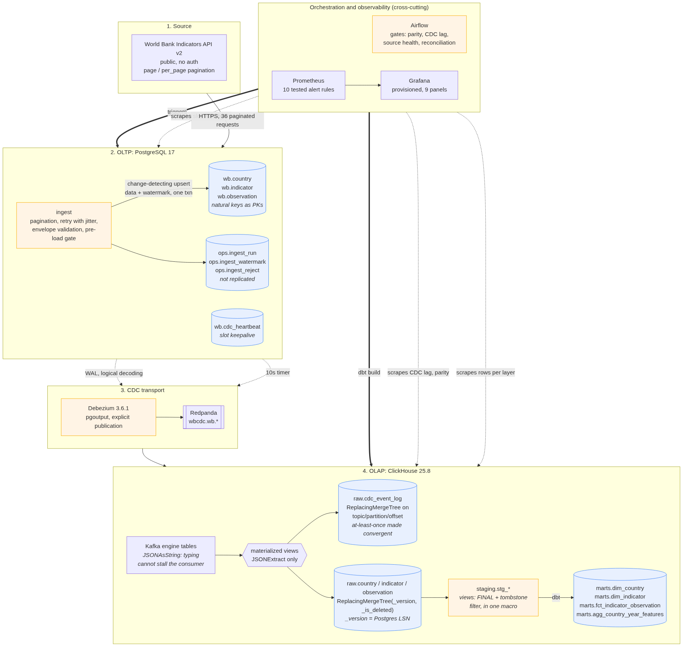
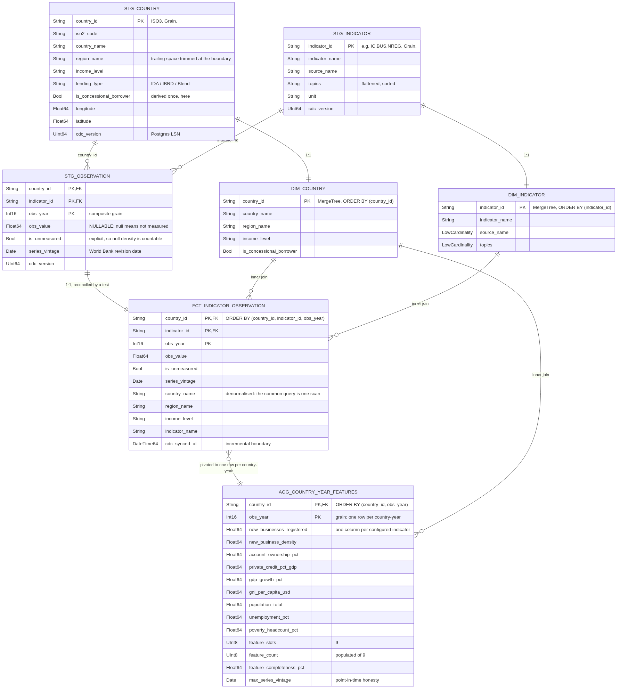

# Design report

**Senior Data Engineer position assessment** | Matiwos Desalegn | August 2026
Repository: [`wb-cdc-analytics`](../README.md) | One command: `make demo`

---

## Executive summary

A public REST API is ingested into PostgreSQL, change events are streamed out of the
write-ahead log by Debezium into ClickHouse, and dbt shapes a staging layer, an analytics
mart and an ML feature table. It starts with `make demo` and verifies itself with
`make verify`.

Measured on this stack: 2,970 observations (5 countries, 9 indicators, 66 years); **about 3
seconds** from PostgreSQL commit to a queryable ClickHouse row; 58 dbt tests and 59 unit
tests green; 10 Prometheus alert rules, each unit-tested with `promtool`.

Three decisions I would defend, each preventing a failure that produces **no error at all**:

1. **The natural key is the primary key.** Under `REPLICA IDENTITY DEFAULT` a delete event
   carries only the primary key, so a surrogate would make deletes arrive downstream as an
   integer with no way to identify what was removed.
2. **The upsert is change-detecting.** Without `WHERE source_hash IS DISTINCT FROM ...`, a
   re-ingest rewrites every row and each no-op update emits a CDC event, so the change
   stream describes the scheduler instead of the data.
3. **The Kafka engine reads raw JSON and types in materialized views.** Typed Kafka-engine
   columns look cleaner and are a trap: a parse failure fails the block, offsets are never
   committed, and the consumer retries forever in silence.

I optimised for decisions I can defend and for failures that announce themselves. Most of
what I have had to debug in production was not a component that crashed but a component that
kept running while quietly doing the wrong thing, so wherever there was a choice between a
design that reads elegantly and one that fails loudly, I took the second.

## Architecture diagram

Source: [`diagrams/src/architecture.mmd`](../diagrams/src/architecture.mmd), also inline in
the [README](../README.md). Nine containers at full extent; the **core data path is four**
and fits in ~2.5 GB, with observability and orchestration behind Compose profiles. Every
image tag pinned, every stateful service healthchecked, dependents gated on
`service_healthy` rather than start order.

## Data flow explanation

Following **one record** end to end, naming the guarantee at each hop. The record is
Ethiopia's *New businesses registered* value for 2023.

| Hop | What happens | Guarantee |
|---|---|---|
| **API to memory** | `GET /v2/country/TCD;ETH;KEN;RWA;SSD/indicator/IC.BUS.NREG?page=3&per_page=100` | At-least-once, safe: nothing is written yet, and retries use backoff with jitter |
| **Validation** | Typed contract. `countryiso3code` is used, **not** `country.id`, which is ISO2 here. Series vintage attached from page *metadata*. Content hash over business fields only | Fail-closed: a bad row is rejected with a reason into `ops.ingest_reject`, and a mostly-rejected batch fails the run |
| **Load to PostgreSQL** | `ON CONFLICT (country_id, indicator_id, obs_year) DO UPDATE ... WHERE source_hash IS DISTINCT FROM EXCLUDED.source_hash` | Idempotent and quiet. Verified: a second run reports `unchanged=2970`. Data, audit row and watermark commit in **one transaction**, so a recorded position can never claim work that rolled back |
| **WAL to Debezium** | Logical decoding via `pgoutput`, explicit publication over four tables | At-least-once, positioned by LSN. Explicit publication means adding an unrelated table cannot silently change what streams |
| **Debezium to Redpanda** | `ExtractNewRecordState` flattens the envelope, adds `__op`, `__lsn`, `__deleted`, `__source_ts_ms` | `delete.tombstone.handling.mode=rewrite` is what makes deletes **visible** rather than absent |
| **Redpanda to ClickHouse** | Kafka engine reads one `String`; two views fire, one to an immutable log, one to typed current state | At-least-once **made convergent**: offsets commit after the block flushes, so a crash re-delivers, and the log's sort key is the Kafka coordinate triple so a duplicate collapses into the row it duplicates |
| **Landing to staging** | `FINAL` plus `_is_deleted = 0`, both from a single shared macro | Exactly-once in effect: versions converge to the highest `_version`, which is the source LSN, so "newest" follows the source's commit order, not arrival order |
| **Staging to marts** | `dbt build`, `delete+insert` on the natural key, lookback window | Idempotent. Verified: three consecutive builds leave the fact at exactly 2,970 rows |

The honest summary: **every hop is at-least-once, and the design makes duplication harmless
rather than pretending it cannot happen.** Two mechanisms do that work throughout: a natural
key that is stable and present at every hop, and version columns that make "latest" a
property of the source rather than of timing.

## Data model and schema documentation

Source: [`diagrams/src/erd.mmd`](../diagrams/src/erd.mmd). The landing layer mirrors the
OLTP schema plus CDC metadata, so the ERD shows staging and marts.

Four layers, each with exactly **one writer**, so "who put this row here" always has one
answer: `raw` (materialized views), `staging` (dbt views), `marts` (dbt tables), `ops`
(pipeline metadata). Three entities, not thirty: two dimensions plus one fact is the minimum
that makes referential-integrity tests meaningful and an ERD worth drawing. **Scale is
demonstrated along the indicator axis**, which is a config list, not a schema change.

### Table engine selection

| Table | Engine | Why |
|---|---|---|
| `raw.<entity>` | `ReplacingMergeTree(_version, _is_deleted)` | CDC produces many versions per key. `_version` is the **Postgres LSN**, monotonic per server, so "newest" follows the source's commit order. Arrival time would reorder events under retry |
| `raw.cdc_event_log` | `ReplacingMergeTree` on `(topic, partition, offset)` | That triple is globally unique per message, so an at-least-once redelivery collapses into the row it duplicates |
| `staging.*` | View | It only deduplicates, drops tombstones and renames. Storing that adds a second copy that can go stale |
| `marts.dim_*`, `agg_*` | `MergeTree` | Staging already collapsed the versions, so these have one row per key by construction. A Replacing engine would add merge work with nothing to merge |
| `marts.fct_*` | `MergeTree`, incremental `delete+insert` | Idempotent re-application on the natural key, which matters because the orchestrator retries |

**Three `ReplacingMergeTree` traps, all producing wrong data rather than errors.**
Deduplication happens at **merge time** and merges are asynchronous, so between merges the
table legitimately holds several versions and a plain `SELECT` returns duplicates; correct
reads need `FINAL`. Second, `SELECT ... FINAL` *does* hide `_is_deleted` rows on 25.8.29
(measured both ways) but does **not** remove them from disk, so any read omitting `FINAL`
still sees them. Third, a Replacing engine with no `ORDER BY` collapses the table to **one
row**, because dbt-clickhouse emits `ORDER BY (tuple())` when `order_by` is unset.

The control: `FINAL` and the tombstone filter live in **exactly one macro**, and engine plus
sort key are always declared together in a model's own `config()` block. A CI convention
gate enforces both.

### Ordering key

The sort key defines row identity for deduplication, so it is **exactly the source primary
key**, no more and no less. Adding a column would stop an update collapsing onto the row it
updates; omitting one would merge distinct entities. `raw.observation` and the fact both
order by `(country_id, indicator_id, obs_year)`, which is also the access pattern: filter
country, then indicator, then range-scan years. No sort key contains a `Nullable` column,
because a nullable business key cannot identify a row.

### Partitioning key

**`PARTITION BY tuple()` everywhere except the event log: deliberately not partitioned.**
Partitioning prunes scans and drops data cheaply *at scale*; at 2,970 rows it does neither.
It would create many small parts, push towards the `too_many_parts` threshold (an
approaching **write outage**, since ClickHouse refuses inserts past 300 parts per
partition), and slow merges, which for a Replacing engine directly slows deduplication.

The adoption trigger is written down rather than left to taste: **partition by month past
roughly 100 million rows, or when retention needs whole-partition drops.** The event log
*is* partitioned by month, because it is the one table with a TTL and monthly partitions let
expiry drop parts instead of mutating rows. A Grafana panel tracks active parts, so the
decision is monitored rather than asserted.

### Materialized views

Six. A ClickHouse materialized view is an **insert trigger**, not a cached query. Two per
topic: one appends to the immutable log, one maintains typed current state. Separate because
they have different keys, engines and retention, and because a fault in the modelling view
must not stop the log from recording what arrived.

The key decision is that the Kafka engine table has **one `String` column** with
`kafka_format = 'JSONAsString'`. The obvious alternative, `JSONEachRow` with typed columns,
fails brutally: a message that does not fit throws, the block fails, offsets are **not**
committed, and the engine retries the same block forever. Nothing inserts, no client sees an
error, and the only symptom is a landing table that stopped growing. With `JSONAsString` the
consumer cannot fail, typing moves into views using only `JSONExtract*` (which returns a
default rather than throwing), and the pipeline degrades to nulls instead of stalling.

Every cast was verified against a live server, and the wire format read off a real topic.
Three encodings would have been wrong if assumed: `__deleted` is the **string** `"true"` (so
`JSONExtractBool` returns false for a deleted row, resurrecting every delete); a `DATE`
arrives as an int32 day count while a `TIMESTAMPTZ` in the same row arrives as an ISO-8601
string; and delete events fill non-key `NOT NULL` columns with **schema defaults**, not
nulls. Details: [`docs/cdc-wire-format.md`](cdc-wire-format.md).

## Data quality and validation at each stage

Nine mechanisms across six stages, each either a gate in the DAG's critical path or a test
in `dbt build`.

| Stage | Mechanism | Catches |
|---|---|---|
| API response | Envelope **shape** validation, not status code | An error returned with HTTP 200. Ingesting zero rows looks identical to an indicator with no data |
| API response | Per-indicator completeness on the **fact** stream | An **archived** indicator, which serves valid metadata while its data endpoint returns an error envelope. Neither a metadata check nor a row-count floor detects this |
| Parse | Typed contracts, whitespace and empty-string normalisation, in-batch duplicate detection | A trailing space splitting a group-by; `""` defeating null checks; a source returning a key twice |
| Pre-load | Domain invariants: key in the configured set, coordinate and year ranges, finite values, referential integrity | An aggregate row double-counting a dimension; NaN, which compares false to everything and defeats equality *and* range tests |
| Batch | Empty-batch and reject-ratio assertions | A partial load reporting success |
| CDC transport | Connector and task state, slot lag, **source-to-warehouse parity** | Dropped events, invisible in every other signal |
| ClickHouse landing | Quarantine view over the event log; consumer exception check | An unattributable key; a silently stalled consumer |
| dbt | 58 tests: `unique`, `not_null`, `relationships`, `accepted_values`, `accepted_range`, plus 5 singular tests | Dedup errors, join fan-out, a resurrected tombstone, an incremental model degraded to an append |
| DAG gates | Parity, CDC lag, source health, marts reconciliation | The above, re-asserted in the critical path so the guarantee survives `dbt run` without tests |

**On Great Expectations.** The brief permits *"a testing framework of your choice (e.g.
pytest, dbt tests, Great Expectations)"*, and I chose dbt tests plus pytest. dbt tests run
**inside** the warehouse after transformation and are right for uniqueness, referential
integrity and business rules, because they live next to the models they constrain. What they
structurally cannot reach is a payload that has not landed yet. Something must occupy that
earlier slot; in a team deployment I would put GX there specifically because Data Docs give
a non-engineer an auditable record of what was rejected and why. Here the slot is filled by
explicit assertions in `ingest/checks.py`, labelled in the code as the gate GX would own,
because every check this boundary needs is structural rather than distributional. The place
I would reach for GX first in *this* pipeline is the ML feature boundary, where the useful
expectations are distributional (null-rate profiles, cardinality bounds, label degeneracy)
and genuinely are GX's strength rather than dbt's.

## Observability design

| Signal | Source | Threshold | What a human does |
|---|---|---|---|
| **CDC lag** | Debezium heartbeat, via the exporter | > 300s for 2m | Check connector and task state, then `system.kafka_consumers` for a stalled consumer |
| **Pipeline health** | `ops.ingest_run`, `ops.layer_counts` | parity < 99% for 10m | Compare topic high watermark against landing count; `make verify` prints both |
| **Data freshness** | `raw.cdc_event_log` | > 24h **and** heartbeat healthy | Check the ingestion DAG. Alone, informational |
| **Resource usage** | ClickHouse `:9363`, Redpanda `:9644`, natively | parts > 300 for 15m | Check insert batch size, then the partition key |
| **Source health** | `pg_replication_slots` | > 1 GiB for 5m | `make drop-slot` if inactive. This threatens the **source** disk |
| **Data quality** | quarantine and reject tables | > 0 for 5m | Read the reasons; usually a source schema change |

**The distinction that matters most is between CDC lag and data freshness, and I got it
wrong first and fixed it by measurement.** With lag computed per business table, an idle
dimension reported 1,805 seconds of "lag" after half an hour in which nothing had changed.
Nothing was wrong. Alerting on that pages someone nightly for a table with no news. Lag is
now measured against a heartbeat row updated on a fixed 10-second timer, which means
connector liveness; per-table freshness is separate and informational, and the freshness
alert is explicitly suppressed while the heartbeat is unhealthy, because two alerts for one
root cause is how a rota learns to ignore both.

**Tools.** Prometheus and Grafana, with **no exporter sidecars**: ClickHouse and Redpanda
expose Prometheus metrics natively, so the usual exporter containers are unnecessary. Two
fewer containers, two fewer reasons a dashboard is empty. The one exporter covers only the
data-plane signals that live in tables. It queries at **scrape time** rather than caching,
because a cached value lets Prometheus stamp a fresh timestamp on stale data; and a failed
query yields **no metric** rather than a zero, because zero is a plausible row count while
an absent series makes a gap and fires `absent()`. Grafana is provisioned from the
repository with **no plugins**, because the ClickHouse datasource plugin would make the
container's start depend on reaching grafana.com.

**Alert rules are code, and untested rules fail silently**, so all 10 have `promtool` tests
covering firing *and* staying quiet. That caught two bugs review would not have.
`CdcParityBroken` divided two series with different label names, and PromQL matches on the
full label set, so it evaluated to an empty vector and **could never have fired** while
looking exactly like a passing rule. And `ServiceDown` set a static `component` label, which
overrides the scraped one, so a ClickHouse outage would have been relabelled "platform".
Alertmanager routing is deliberately not wired: it adds a container and credentials to prove
something invisible in a ten-minute review. Every rule carries a runbook instead.

## CDC operational failure modes

*Added section. These are what separate a CDC pipeline that survives production from one
that works on a laptop, and the design above is shaped by them.*

**1. The forgotten replication slot.** An inactive logical replication slot retains WAL
indefinitely so a consumer that might return can resume. If none returns, WAL accumulates
until the **source** database's disk fills, and nothing about the connector looks wrong
because the connector is gone. Three controls: `max_slot_wal_keep_size=2GB` so the server
invalidates the slot rather than filling its disk; a heartbeat so the slot advances even when
captured tables are idle; and `make down` drops the slot explicitly.

I have recovered a managed PostgreSQL cluster where three abandoned replication slots were
each retaining hundreds of GB of WAL. It presented as disk pressure on the primary rather than
as anything wrong with the pipeline, and the connectors that owned the slots looked healthy
throughout. The expensive part was not the diagnosis: I dropped the slots and reclaimed the
space, and the connectors reconnected and recreated them within minutes, so the disk began
filling again. That is why the controls here are ordered the way they are. `make down` deletes
the connector and waits for it to release the slot before dropping it, and it refuses to drop a
slot that is still active rather than failing quietly; `max_slot_wal_keep_size` is set on the
server so that the same mistake is bounded even when nobody is watching.

**2. Dedup ordering, when a log position is compared as text.** Any "latest version wins" rule
needs a total order over log positions, and the trap is that the obvious ordering is a string
comparison. That applies directly to this pipeline. A Postgres LSN is rendered as hex with a
slash, and compared as text `0/10000000` sorts **before** `0/9FFFFFF` even though it is the later
position, so a dedup keyed on the text form would elect a stale row for any key with events
either side of a digit-count boundary. This design avoids it by construction rather than by
care: Debezium emits `__lsn` as a JSON integer, the materialized views extract it with
`JSONExtractUInt` into a `UInt64`, and `ReplacingMergeTree` therefore compares versions
arithmetically.

I have hit this class of bug in production, in a MySQL-based pipeline rather than a Postgres one,
where the dedup ordering key was the binlog file name compared as a string: at the rollover from
`mysql-bin.999999` to `mysql-bin.1000000` the comparison inverts, and for any key with events on
both sides of that boundary the older row won, silently. The fix was to sort on the numeric
suffix of the file name rather than on the name. It is why the version column here is a number
before it is anything else, and why I now treat "what is the total order over log positions" as a
question to answer explicitly rather than a default to inherit.

**3. Logical decoding carries no DDL.** Postgres streams row changes, not schema changes, so
schema drift surfaces **in the data**. This design absorbs that: `JSONAsString` plus
`JSONExtract` means an unexpected payload produces nulls rather than a stalled consumer, and
the immutable log retains the original payload so a model can be re-derived once the schema
is understood. Without a Schema Registry there is no wire-level evolution contract, and that
is the first thing I would add.

**4. Snapshot memory pressure.** An initial snapshot streams a whole table through the
connector, and a buffered read will exhaust a modestly sized worker. A non-issue at this
volume; the first thing to size for at production volume.

## Scaling and extending for increasing data volume

Three horizons, each with a **numeric trigger** rather than a vague "at scale".

**Horizon 1, same shape, 100x data (~300M fact rows).** Adopt monthly
`PARTITION BY toYYYYMM(...)` past ~100M rows so expiry and backfill drop whole parts. Switch
staging views to incremental tables once `FINAL` at query time becomes measurable. Raise
topic partitions and `kafka_num_consumers` together, since ClickHouse consumer parallelism
is bounded by partitions. Move the fact model from `delete+insert` to `insert_overwrite` on
the partition, avoiding mutations entirely.

**Horizon 2, more sources and durability.** A Schema Registry with Avro, so schema evolution
has a wire-level contract instead of being discovered in the data. `ReplicatedMergeTree` with
ClickHouse Keeper and a `Distributed` table; note the dbt adapter's distributed
materializations are experimental and read-after-write on a cluster needs care. Per-source
connectors, so a slow source cannot hold up another's slot. Airflow moves to
KubernetesExecutor with one pod per task, and the DAG becomes a factory over a source
manifest, so a new source is a config entry. Alertmanager routing on the existing rules.

**Horizon 3, what changes qualitatively.** Below ~10M rows per table this design is
over-engineered and a scheduled batch copy would do. Above ~1B the single-node assumption
breaks and the interesting problems become shard-key selection and whether the mart should be
pre-aggregated rather than recomputed. The read-acceleration ladder, in climbing order:
sort-key refinement, projections, dictionaries for dimension lookups,
`AggregatingMergeTree` rollups, then tiered storage with TTL moves. Building any of them at
2,970 rows would be theatre.

**The cheapest axis, already built.** Adding indicators is a config change in
`ingest/indicators.yml`, because the fact is keyed on `(country, indicator, year)`. A new
series is more rows, never more columns.

## Trade-offs, and what I would do with more time

| Chosen | Rejected | Why, and what it costs |
|---|---|---|
| Redpanda | Kafka + ZooKeeper | One container instead of three, `rpk` for demos, Kafka-API compatible. Cost: not the exact runtime named in the brief |
| ClickHouse Kafka engine + views | `clickhouse-kafka-connect` sink | No custom Connect image or plugin install, and it produces real materialized views to reason about. Cost: weaker per-connector observability than Connect's REST API and DLQ |
| Plain JSON on the wire | Schema Registry + Avro | One fewer container, topics readable with `rpk`. **Cost: no wire-level schema-evolution contract.** First thing to add |
| dbt tests + pytest | Great Expectations | Structural checks, cheaper and more precise here, and unit tested. Cost: no Data Docs artifact for non-engineers |
| Current-state marts | SCD2 history | Matches the source, which is itself current-state. The 30-day event log means history is reconstructable with a dbt snapshot |
| `airflow standalone`, 2 containers | Split webserver/scheduler/worker | Fits alongside a broker, a JVM and two databases on one laptop. Cost: a demo topology, not production. The production one is described above rather than half-built |

**With more time, in priority order:** a Schema Registry, the one missing piece with a real
correctness consequence; a GX suite at the ML feature boundary; the `ReplicatedMergeTree`
migration, since the path is written down; dbt snapshots over the event log to reconstruct
history; per-source connector isolation.

What I would most want to talk through is where the boundary should sit between the warehouse
and the feature layer. `agg_country_year_features` carries completeness and series vintage on
each row so a model author can see what they are training on, and I am genuinely unsure whether
that belongs there or in a feature store with point-in-time joins.

The thing I found most interesting here was smaller and more specific. Measuring CDC lag per
table looked obviously correct and was wrong: an idle dimension reports the same number as a
stopped connector, so the signal cannot distinguish "nothing changed" from "nothing is
arriving". Splitting connector liveness from data freshness took about ten minutes and changed
which alert I would trust at three in the morning.

---

**Deliberate scope boundaries** are recorded in [`docs/SCOPE.md`](SCOPE.md), frozen before
any code was written: Great Expectations; Schema Registry and Avro; ClickHouse clustering and
sharding; projections, dictionaries, rollups and TTL beyond the ops tables; SCD2 history;
Alertmanager routing; any BI layer, Terraform or Kubernetes manifests. A stated omission with
a reason is a decision; a silent one is a gap.
